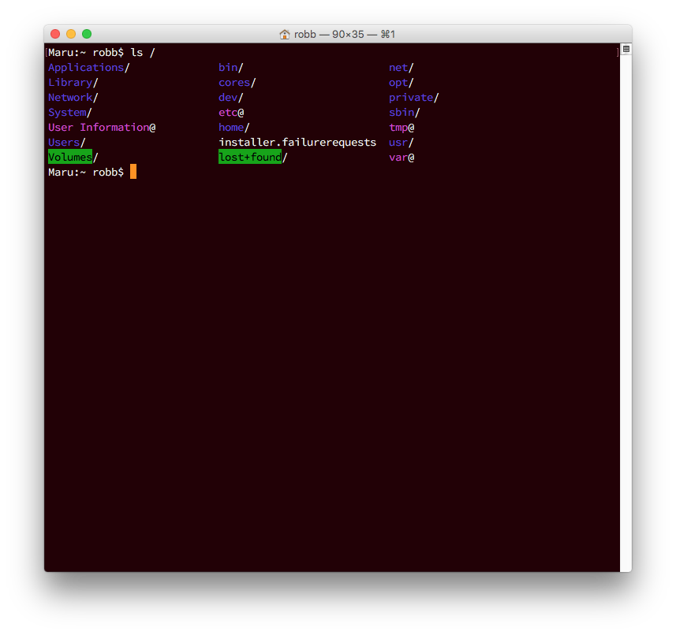

# The Development Environment

## Set up Your Terminal

[TBD: "Before": Screenshot of typical out-of-the-box terminal appearance]

Here's a typical terminal as you'd see a developer use, with the minimal enhancements:

Customizations you can see above:

* New font: [Adobe Source Code Pro](http://adobe-fonts.github.io/source-code-pro/)
* Window set to a good default size, 90 columns x 35 rows.
* Light text on a dark background
* Colorized output (part of *Set up the Shell*, below)
* Unimportant information removed from the prompt (part of *Set up the Shell*, below)

[TBD: "After, take 2": Screenshot of a typical highly customized terminal, via oh-my-zsh.]

## Set up the Shell

[TBD: Common Aliases]

[TBD: oh-my-zsh]

