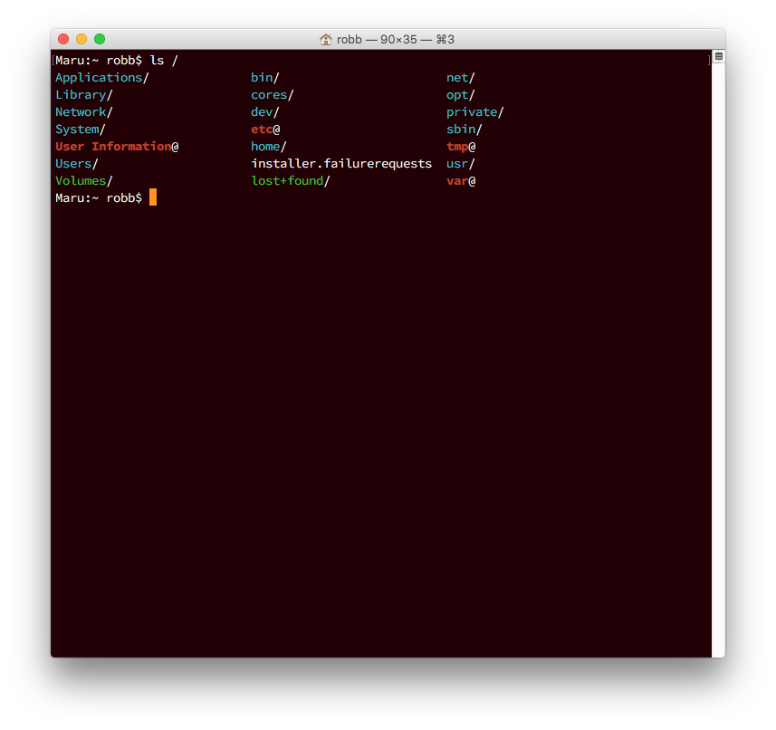

# The Development Environment

## Set up Your Terminal

You've probably seen the default Terminal appearance:

Professional programmers don't use it like this, though. We customize the hell out of the terminal. It's a personal thing; everyone has their own preferences. Here's what you might see a developer use in real life:

Customizations that were applied:

* Font changed to [Adobe Source Code Pro](http://adobe-fonts.github.io/source-code-pro/)
* Default font size to 14 pt.
* Window size, 90 columns x 35 rows
* Light text on a dark background
* Customized text in the window bar to clean it up
* Colorized output (part of *Set up the Shell*, below)
* Unimportant information removed from the prompt (part of *Set up the Shell*, below)
* Extra characters `/`, `@`, and `*` added to names in the directory listing (part of *Set up the Shell*, below)
* Plus, some behaviors you can't see in the screenshot.

[TBD: "After, take 2": Screenshot of a typical highly customized terminal, via oh-my-zsh.]

## Set up the Shell

[TBD: Common Aliases]

[TBD: oh-my-zsh]

